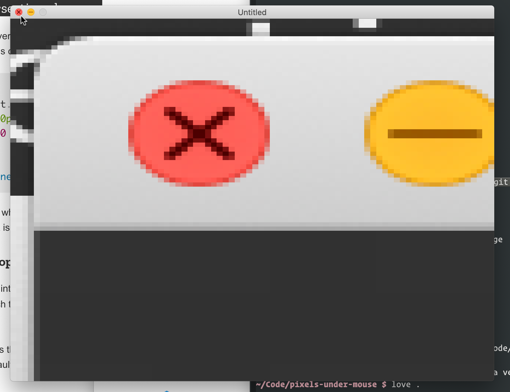

# pixels-under-mouse

Need to `brew install love`.

`$ love .`

It's all in [main.lua](main.lua). Edit the CGRect to however many
pixels you want!

## notes

This isn't that interesting on its own. Just is a useful building
block for other stuff.

I've pushed hard to keep it in one file and have no hard dependencies
(other than LÖVE, but that's big, widely-used and well-supported, and
seems easy enough to install).

It's very cool to have an inline, live view of [memory
usage](https://twitter.com/rsnous/status/1331897561657950213)
([memoryusage.lua here](memoryusage.lua)). You can comment and
uncomment every fix you try for a memory leak,
[hot](https://twitter.com/rsnous/status/1314002267742244865)
[reload](https://twitter.com/rsnous/status/1314659277663944704) it in,
and watch the velocity of that memory usage number change. almost want
to have that (derivative of memory usage) as another separate
metric. maybe draw it as a vector or something

[hah](https://twitter.com/rsnous/status/1331836849178886145)

## license

MIT
